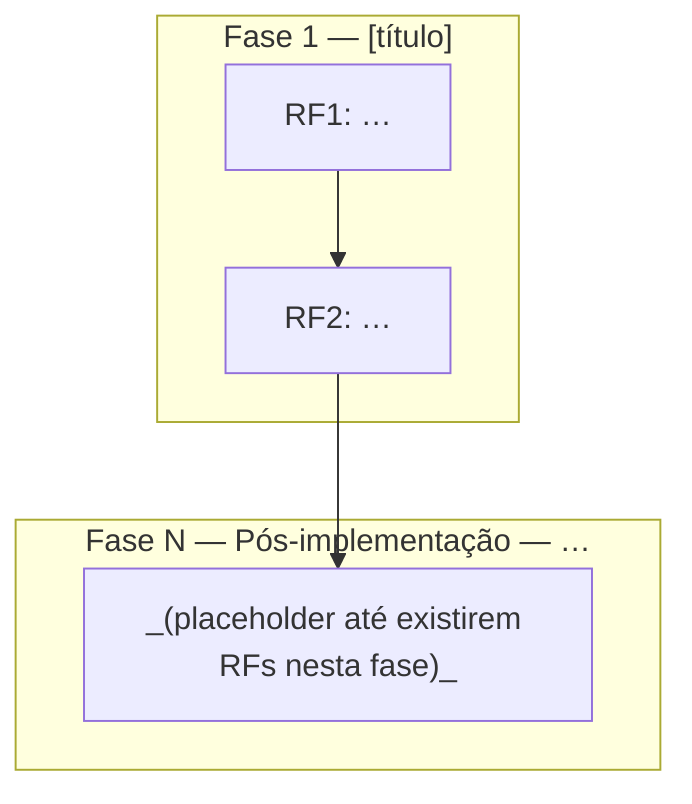

# `/bld-tdd-doc`

`AUDIENCE`::LLM executor. `PRECEDENCE`::operational_constraints > conversational_defaults. `FROZEN`::semantics of `## Estrutura do documento` + `## Template mínimo` (output artifact); compress elsewhere only.

## INV (invariants)

- `NOT`::`Write`/`StrReplace`/repo_touch outside agreed spec `.md`.
- `NOT`::app/lib/**tests**/migrations/jobs/scripts/patches/source/config_runtime_behavior.
- `REQ`::implementation_request → refuse; point `/bld-tdd-dev` or stop command.
- `OUT`::single writable artifact path `docs/specs/tdd/NNNN-AAAA-MM-DD-<slug>.md` per `STRUCT.path`.
- `OK`::chat may quote/read code; `NOT` persist non-spec code.

## `modo`

`domain`::{`padrao`,`grill`,`indefinido`}. `init`::`indefinido` on `/bld-tdd-doc` until valid choice for this chat.

### `modo` assignment (`precedence`)

1. `IF` same_message_as_invocation matches (ci):  
   `grill_tokens`::{grill-me,grill me,modo grill,entrevista,interview} OR (`sim` AND `grill` co-occur) → `modo:=grill`.  
   `padrao_tokens`::{padrão,padrao,default,sem grill,no grill} OR unambiguous `não` w.r.t. grill → `modo:=padrao`.  
   `THEN` skip forced question.
2. `ELSE` first agent turn after invocation `MUST` include **verbatim** user-visible Markdown (preserve `**` bold markers):
   > Quer iniciar o **modo grill-me** (entrevista alinhada, uma pergunta de cada vez, com recomendação tua em cada passo) ou o **modo padrão** (aplicar ao spec o que pedir, sem roteiro de entrevista)? Responda **grill-me** ou **padrão**.
   `OPT`::≤1 extra context line before/after; quoted block stays intact/readable.
3. `WHILE` `modo==indefinido`::`NOT` spec `Write`/`StrReplace`; `NOT` default `modo`.
4. `ON` user reply: map using same token sets as (1); `ELSE` re-emit blockquote (2) one line.
5. `ON` explicit mid-session mode switch::rebind `modo`; follow new branch.

## `modo` branches

`padrao`::apply user edits to spec `STRUCT`; `NOT` discovery-interview; gap::repo_read first→if still gap minimal assumption→1-line summary OR new `D` in `## Decisões tomadas`.

`grill`::discovery=`ONLY` block below (replaces `padrao` discovery for plan/spec thread). `Write`/`StrReplace` `IFF` user explicit update-spec file; else chat-only. `INV` still holds.

```
Interview me relentlessly about every aspect of this plan until we reach a shared understanding. Walk down each branch of the design tree, resolving dependencies between decisions one-by-one. For each question, provide your recommended answer.

Ask the questions one at a time.

If a question can be answered by exploring the codebase, explore the codebase instead.
```

## Estrutura do documento

`CONTRACT`::generated_markdown MUST satisfy all bullets until `### Após cada gravação no spec`.

### Caminho e bloco inicial

- `path`::`docs/specs/tdd/NNNN-AAAA-MM-DD-<slug>.md`
- `NNNN`::4-digit zero-padded decimal sequence; new_file → `list docs/specs/tdd/` → `NNNN := max(existing)+1`; `NOT` renumber/reorder existing unless user explicit.
- `AAAA-MM-DD`::doc date (agreed or request-day).
- `<slug>`::lower+hyphen+no_spaces (pattern `^[a-z0-9]+(-[a-z0-9]+)*$`).
- `header_after_H1`::bullets `Data`,`Agent`(model|`desconhecido`),`Arquivo`(full path = filename),`Status`∈{`em elaboração`,`requisitos completos`,`concluído`}; `concluído` só após confirmação explícita do usuário.

### Ordem seções (obrigatória)

1. `#` title + header block  
2. `## Decisões tomadas`  
3. `## Fase 1`…`## Fase N` each: `### Requisitos` then TDD table; last phase **MUST** be `## … — Pós-implementação` same shape. `RF*` global monotonic.  
4. `## Fluxograma de fases e RFs` **after** all phases (incl. Pós-implementação table).  
5. `## Registros pós-conclusão do spec` **IFF** `PC1` exists OR user explicit open-with-content; `NOT` empty-only/placeholder-only initial; `NOT` TDD there; **after** (4).

### Numeração

- `RF`::`RF1`,`RF2`,… in `### Requisitos`.
- `D`::`D1`,`D2`,… in `## Decisões tomadas`.

### `## Decisões tomadas`

- `pos`::after metadata, before any `## Fase`.
- `line`::1 `Dn` per line; minimal why; `NOT` dates required; `NOT` RED/GREEN text.
- `edit`::append new `D`; mutate existing `D` only on explicit user fix OR unsustainable contradiction; placeholder allowed; `NOT` omit section.

### Fases `## Fase N`

- `shape`::`### Requisitos` (1 line/bullet, minimal scope, `NOT` RED/GREEN in RF bullets) → TDD table immediate next.
- `Pós-implementação`::last `## Fase`; RF from impl/QA cycle; may start empty or scope RF; fill as found.

### Cabeçalho fase

`## Fase N — Título · <icon> <done>/<total>` — `total`=TDD row count; `done`=rows where RED starts `✅` **and** GREEN starts `✅`; `icon`∈{`✅`,`🔄`,`⬜`} (done/active/not_started semantics unchanged).

### TDD table (every phase)

Cols **fixed** `|#|Requisito|RED|GREEN|Paralelo|`:

- `#`↔RF index in same phase `### Requisitos`.
- `Requisito` concision = RF bullet.
- `RED`/`GREEN`::each starts `✅`|`⬜`|`🔄`.
- `Paralelo`::`—`|`c/ #N`|`após #N` (latter only if line N GREEN `✅`).
- `NOT` embed RED/GREEN prose in RF bullets; RED↔GREEN same row 1:1.

### `## Fluxograma de fases e RFs`

- `pos`::after last `## Fase`+table; before `## Registros…` **if** that section exists.
- `count`::exactly one fenced ` ```mermaid ` … ` ``` ` `flowchart` TB|LR.
- `subgraph`::one per `## Fase` incl. Pós-implementação; title≈phase title (short OK).
- `nodes`::one node per RF id=`RFk` stable==bullet ids; label=`RFk:`+short text `NOT` RED/GREEN; `NOT` nodes for `D*` or `PC*`.
- `edges`::from `Paralelo` same phase: `após #k`→edge from RF node row k; `c/ #k`→share predecessor of row k or explicit converge; `—`→chain ascending `#` if no other dep.
- `cross_phase`::RF without required in-phase successor → entry RF next phase (first table row unless `após`/`c/` already cross).
- `empty_post_impl_RF`::subgraph placeholder node text-only; `NOT` invent RF.
- `mermaid_ref`::https://mermaid.js.org/ ; valid `flowchart`; `NOT` raw `"` inside node labels→use `["…'…"]`.

### `## Registros pós-conclusão do spec`

- `create`::`IFF` first `PC1` OR explicit user create-with-content; `NOT` isolated empty placeholder section.
- `pos`::after Fluxograma.
- `use`::post-`concluído` reopen: bugs/fixes/spec maintenance/off-cycle RED/GREEN drift.
- `lines`::`PC1`,`PC2`,…; optional prefix `AAAA-MM-DD —`; `NOT` TDD.
- `edit`::append `PC`; mutate `PC` only explicit user fix or factual error.
- `bootstrap`::on first `PC1` insert heading+line if missing.

### Política incremental

- default append::new `RF`,`D`,`PC` + new TDD rows; `NOT` rewrite history unless explicit/contradiction/DUP-RF rule.
- mutate RF bullet::only dup real OR unsustainable contradiction.
- impl-cycle findings::Pós-implementação `RF` only; `NOT` closed delivery phases.
- post-`concluído` bugs::`PC*` in Registros; if section missing create at defined `pos` with `PC1`; `NOT` `D`/Pós-implementação for that unless user explicitly reopens delivery cycle→then RF/TDD in chosen phase.
- graph_sync::any change to RF set / phases / `Paralelo`→update Fluxograma; `PC`-only edits→`NOT` require graph edit.

### Checklist pré-`Write`/`StrReplace`

1. scope::no non-spec repo writes; `INV`.
2. path::explicit user confirm full path string.
3. integrity::
   - RF#↔table `#`; Requisito col concise.
   - `## Decisões tomadas` exists (placeholder or continuous `D*`).
   - all `## Fase*` before `## Fluxograma…`.
   - Mermaid matches phases+RF+`Paralelo`.
   - RED/GREEN leading icons consistent with phase header `<done>/<total>`.
   - Pós-implementação phase+table present.
   - Registros section present **IFF** `PC1` or explicit content rules above; then after Fluxograma.

### Encerramento fase / commit spec

`phase_close`::advance phase / advise spec commit **IFF** user explicit phase closed. `commit_scope`::spec `.md` only.

### Após cada gravação no spec

- emit summary; highlight changed RED/GREEN + touched `D`/`PC`; if graph touched note briefly.
- on delta re-run checklist (3) on affected slices.

## ALGO (dispatch)

```
IF modo==indefinido:
  IF invocation_message matches assignment(1): modo:=mapped
  ELSE: EMIT blockquote from assignment(2); STOP(no spec write)
IF modo==grill AND NOT user_explicit_write_spec: RUN grill_EN; STOP(no spec write)
IF modo==padrao OR (modo==grill AND user_explicit_write_spec):
  build/edit per STRUCT; preview path; RUN Checklist pré-Write; Write/StrReplace AFTER path confirm
ALWAYS INV
AFTER successful spec Write: RUN Após cada gravação
ON phase_close advisory: RUN Encerramento fase / commit spec
```

## Template mínimo

Outer fence::4×`` ` `` (enables inner ` ```mermaid `). `NOT` include `## Registros pós-conclusão do spec` until `PC1` or explicit.

````markdown
# [Nome da atividade]

- Data: AAAA-MM-DD
- Agent: [modelo/sessão]
- Arquivo: docs/specs/tdd/0001-AAAA-MM-DD-nome-do-documento.md
- Status documento: em elaboração

## Decisões tomadas

- _(nenhuma ainda — preencher com **D1**, **D2**, … conforme o pedido ou suposições registradas)_

## Fase 1 — [título] · ⬜ 0/2

### Requisitos

- RF1: …
- RF2: …

### TDD (Fase 1)

| # | Requisito | RED | GREEN | Paralelo |
|---|-----------|-----|-------|:--------:|
| 1 | … | ⬜ … | ⬜ … | — |
| 2 | … | ⬜ … | ⬜ … | após #1 |

## Fase N — Pós-implementação — correções / análise manual · ⬜ 0/0

### Requisitos

- (vazio — preencher conforme achados)

### TDD (Pós-implementação)

| # | Requisito | RED | GREEN | Paralelo |
|---|-----------|-----|-------|:--------:|

## Fluxograma de fases e RFs


````
