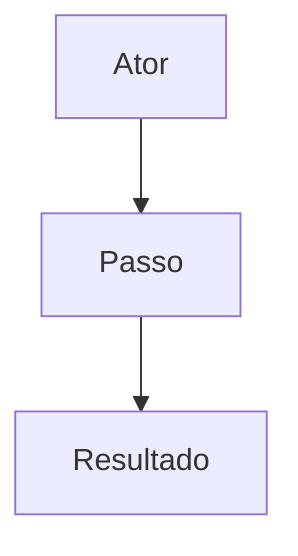
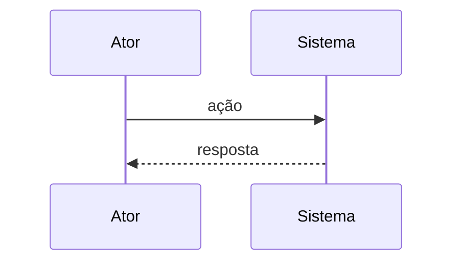

# escrever-tarefa

Documento **simples** de atividade em **pt-BR**. **Sempre** modo entrevista (**grill-me**). **Não** invocar, mencionar nem encaminhar para nenhuma skill além de **grill-me** (carregar e seguir só essa).

**Pacote:** `skills/eduardolagares/escrever-tarefa/` — instalada pelo `install/` em `{destino}/skills/eduardolagares/escrever-tarefa/` (Cursor ou `~/.agents`).

## Pré-requisito: grill-me

No **primeiro turno** desta skill, localizar e ler **grill-me** (`SKILL.md`). Procurar, **por ordem**, o primeiro ficheiro que existir:

1. `~/.agents/skills/grill-me/SKILL.md`
2. `~/.cursor/skills/grill-me/SKILL.md`
3. `~/.claude/skills/grill-me/SKILL.md`

Seguir o conteúdo lido. Se **nenhum** existir, aplicar o contrato grill-me embutido:

```
Interview me relentlessly about every aspect of this plan until we reach a shared understanding. Walk down each branch of the design tree, resolving dependencies between decisions one-by-one. For each question, provide your recommended answer.

Ask the questions one at a time.

If a question can be answered by exploring the codebase, explore the codebase instead.
```

## Invocação com ficheiro

O utilizador pode apontar um ficheiro (caminho no workspace, `@ficheiro`, ou anexo). **Antes** de pedir texto livre, **ler** esse ficheiro com a ferramenta Read.

| Modo | Quando | Artefacto ao gravar |
|------|--------|---------------------|
| **Continuar tarefa** | Caminho sob `docs/tarefas/` terminado em `.md` | **O mesmo ficheiro** — atualizar in-place (`StrReplace` / `Write` nesse path) |
| **Referência** | Qualquer outro ficheiro (outra pasta, `.md`, notas, spec parcial, etc.) | **Novo** ficheiro em `docs/tarefas/YYYY-MM-DD-HHmmss-<slug>.md` (salvo pedido explícito para gravar noutro path) |

**Continuar tarefa:** tratar o conteúdo lido como estado actual (título, resumo, projetos envolvidos, UCs, RFs); a entrevista grill refina ou acrescenta; **não** criar novo timestamp só por continuar a sessão.

**Referência:** usar o ficheiro só como material de entrada (requisitos/jornadas misturados, contexto, links); classificar para o template; o output da gravação vai para `docs/tarefas/` como documento de tarefa novo.

Se o path não existir ou não for legível → reportar e pedir path válido ou texto livre (uma mensagem).

## Primeiro turno (sem ficheiro nem texto)

Se a invocação **não** trouxer ficheiro nem bloco de requisitos/jornadas (ex.: só `/escrever-tarefa`), responder **uma vez** pedindo que o utilizador **cole texto livre** ou indique um **caminho de ficheiro** (referência ou `docs/tarefas/…` para continuar). **Não** começar por pergunta de título antes desse input.

## Interpretação do texto livre

- **Ordem livre** — não há roteiro fixo título → UC → RF.
- Classificar cada trecho:
  - **Projeto:** repositório, app, serviço ou monorepo que será alterado (entra em **Projetos envolvidos**).
  - **UC (jornada):** ator, objetivo, fluxo que a persona percorre.
  - **RF (requisito):** requisito funcional, regra de negócio, validação ou comportamento verificável do **sistema** (não narrativa de jornada).
- Mostrar rascunho da distribuição quando útil; **uma pergunta de cada vez** (grill-me) só onde houver lacuna, ambiguidade ou conflito.
- **UC:** `## UCn Nome curto` + prosa (2–5 frases típicas) + **diagrama Mermaid** que represente o fluxo/jornada desse caso (obrigatório em cada UC).
- **RF:** bullet `- RF n — …` (frase verificável em pt-BR).

## Idioma

Todo o **ficheiro gerado** em **pt-BR** (título, resumo, projetos envolvidos, UCs, RFs). O chat pode ser noutro idioma; o artefacto não.

## Encerrar o documento (antes de gravar)

**Sempre** confirmar **projetos envolvidos** com o utilizador **antes** de considerar o documento fechado ou sugerir gravação — mesmo que o texto livre ou a referência já nomeiem repositórios.

1. Resumir no chat a lista actual (ou “ainda não definida”).
2. Fazer **uma pergunta** (grill-me): quais projetos/repositórios/apps serão alterados; incluir recomendação se o contexto ou o codebase sugerirem candidatos.
3. Só depois de resposta explícita (ou confirmação de “nenhum” / “só este workspace”) encerrar a entrevista ou pedir confirmação para gravar.

Se o utilizador pedir gravar sem ter respondido a esta pergunta → fazer a pergunta **nesse turno** (não assumir lista por defeito).

## Artefacto: caminho e nome

- **Pasta (novo documento):** `docs/tarefas/` no workspace actual (criar se não existir).
- **Nome (novo):** `YYYY-MM-DD-HHmmss-<slug>.md`
  - `<slug>`: derivado do título — minúsculas, hífens, sem acentos/espaços; padrão `^[a-z0-9]+(-[a-z0-9]+)*$`.
  - Timestamp: momento da **primeira** gravação desse documento novo.
- **Continuar tarefa:** manter o path indicado; não renomear por defeito.

## Quando gravar

Gravar **quando**:

1. O utilizador pedir explicitamente (ex.: “salva”, “gera o ficheiro”, “grava”, “pode escrever”); ou
2. A entrevista estiver encerrada por acordo e o utilizador confirmar que pode gravar.

**Até lá:** trabalhar no chat; **não** criar ficheiro novo por iniciativa própria (modo **referência**). Modo **continuar tarefa** pode usar o ficheiro existente só após pedido ou confirmação de gravação.

### Rascunho incompleto

Se o utilizador pedir gravar **antes** de ter título, resumo, **projetos envolvidos confirmados**, UCs ou RFs suficientes: **avisar** o que falta em lista curta e **gravar mesmo assim** (não bloquear), excepto **projetos envolvidos** — se ainda não houve pergunta/resposta sobre isso, **perguntar primeiro** (ver secção anterior); só gravar depois da resposta ou se o utilizador insistir na mesma mensagem após o aviso.

Secções em falta podem ficar com placeholder mínimo (`_A preencher._`) ou omitidas se o utilizador preferir na mesma mensagem. **Projetos envolvidos** vazio sem confirmação explícita de “nenhum” → usar placeholder `- _A confirmar com o utilizador._`

## Formato obrigatório do documento

Usar **exatamente** esta estrutura (substituir conteúdo; manter headings):

```markdown
# Título
Resumo da atividade

# Projetos envolvidos

- nome-do-repositorio-ou-app
- outro-projeto-se-aplicavel

# Casos de uso
Lista dos casos de uso
## UC1 nome do caso de uso
conteúdo do caso de uso em prosa...



## UC2 nome do caso de uso
conteúdo do caso de uso em prosa...



# Requisitos

- RF 1
- RF 2
- RF 3
```

- `# Título` — linha seguinte é o resumo (parágrafo curto, não outro heading).
- `# Projetos envolvidos` — lista com bullets (`- …`); um item por projeto/repositório/app a alterar; nome identificável (ex.: pasta do monorepo, repo Git, serviço). Se a tarefa for só no workspace actual, um bullet com o nome do projeto/workspace. Lista vazia só com confirmação explícita do utilizador de que não há outros projetos.
- Após `# Casos de uso`, uma linha introdutória (ex.: lista resumida ou frase de âmbito) antes dos `## UCn`.
- **Cada `## UCn`:** prosa + bloco ` ```mermaid ` imediatamente a seguir (um diagrama por UC, sem excepção).
  - Preferir `flowchart` para jornadas/passos; `sequenceDiagram` quando o foco for troca ator↔sistema.
  - Rótulos em pt-BR; incluir ator, passos principais e resultado ou estado final.
  - Ao **continuar tarefa**, UC sem diagrama → acrescentar; UC com diagrama desactualizado → actualizar em conjunto com a prosa.
- RFs: lista com `- RF n — …` (número sequencial a partir de 1).
- Renumerar UC/RF de forma contínua ao fundir ou remover itens.

## Proibido

- Mencionar ou delegar a qualquer skill que não seja **grill-me**.
- Implementar código, migrações ou testes neste fluxo.
- Gravar fora do artefacto acordado (`docs/tarefas/…` novo ou ficheiro em continuação) sem pedido explícito do utilizador.

## Exemplos de invocação

```
/escrever-tarefa
/escrever-tarefa <texto livre>
/escrever-tarefa docs/tarefas/2026-05-26-143052-exportar-relatorio.md
/escrever-tarefa docs/referencias/briefing-stakeholder.md
```

Com ficheiro ou texto na mesma mensagem: ler/interpretar de imediato; primeira resposta grill = síntese do que entrou + **uma** pergunta (não repetir o pedido de colar bloco).
