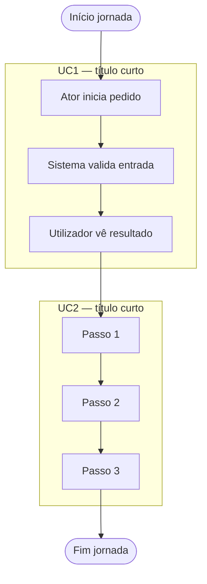

# tdd-doc

## Maintainer note (for editors)

- **Instructions** in this file stay **English-only** (prose, contracts, checklist, ALGO).
- The **generated** TDD spec (`docs/specs/tdd/…`) stays **Portuguese (PT)** for substantive prose; keep frozen PT headings/columns/status tokens; the mode **blockquote** stays verbatim PT.
- **Cohesion:** any edit must stay consistent across Document structure, Minimum template, checklist, incremental policy, ALGO, and `description`; align duplicated rules; bump **`VERSION`** per repo rules.

`AUDIENCE`::LLM executor. `PRECEDENCE`::operational_constraints > conversational_defaults. `FROZEN`::semantics of `## Document structure` + `## Minimum template` (output artifact); compress elsewhere only.

## INV (invariants)

- `NOT`::`Write`/`StrReplace`/repo_touch outside agreed spec `.md`.
- `NOT`::app/lib/**tests**/migrations/jobs/scripts/patches/source/config_runtime_behavior.
- `REQ`::implementation_request → refuse; point `tdd-dev` or stop skill.
- `OUT`::single writable artifact path `docs/specs/tdd/NNNN-AAAA-MM-DD-<slug>.md` per `STRUCT.path`.
- `OK`::chat may quote/read code; `NOT` persist non-spec code.

## `modo`

`domain`::{`padrao`,`grill`,`indefinido`}. `init`::`indefinido` on `tdd-doc` until valid choice for this chat.

### `modo` assignment (`precedence`)

1. `IF` same_message_as_invocation matches (ci):  
   `grill_tokens`::{grill-me,grill me,modo grill,entrevista,interview} OR (`sim` AND `grill` co-occur) → `modo:=grill`.  
   `padrao_tokens`::{padrão,padrao,default,sem grill,no grill} OR unambiguous `não` w.r.t. grill → `modo:=padrao`.  
   `THEN` skip forced question.
2. `ELSE` first agent turn after invocation `MUST` include **verbatim** user-visible Markdown (preserve `**` bold markers). **Language:** Portuguese (PT) copy for end users — emit exactly:
   > Quer iniciar o **modo grill-me** (entrevista alinhada, uma pergunta de cada vez, com recomendação tua em cada passo) ou o **modo padrão** (aplicar ao spec o que pedir, sem roteiro de entrevista)? Responda **grill-me** ou **padrão**.
   `OPT`::≤1 extra context line before/after; quoted block stays intact/readable.
3. `WHILE` `modo==indefinido`::`NOT` spec `Write`/`StrReplace`; `NOT` default `modo`.
4. `ON` user reply: map using same token sets as (1); `ELSE` re-emit blockquote (2) one line.
5. `ON` explicit mid-session mode switch::rebind `modo`; follow new branch.

## `modo` branches

`padrao`::apply user edits to spec `STRUCT`; `NOT` discovery-interview; gap::repo_read first→if still gap minimal assumption→1-line summary OR new `D` in `## Decisões tomadas`.

`grill`::discovery=`ONLY` block below (replaces `padrao` discovery for plan/spec thread). `Write`/`StrReplace` `IFF` user explicit update-spec file; else chat-only. `INV` still holds.

```
Interview me relentlessly about every aspect of this plan until we reach a shared understanding. Walk down each branch of the design tree, resolving dependencies between decisions one-by-one. For each question, provide your recommended answer.

Ask the questions one at a time.

If a question can be answered by exploring the codebase, explore the codebase instead.
```

## Document structure

`CONTRACT`::generated_markdown MUST satisfy all bullets until `### After each spec write`.

**Language (generated spec):** All substantive prose in the written spec file is **Portuguese (PT)** — RF bullets, **D**/**UC**/**PC** lines, free-text table cells, diagram labels where they are user-facing narrative, and header metadata values (`Status documento`, etc.). Keep **section headings and table column headers** exactly as in this skill's template (PT literals). Mermaid **node ids** may stay ASCII (`UC1`, `RF1`, …); node **display labels** inside `["…"]` are **PT** when they carry meaning to readers.

### Path and initial block

- `path`::`docs/specs/tdd/NNNN-AAAA-MM-DD-<slug>.md`
- `NNNN`::4-digit zero-padded decimal sequence; new_file → `list docs/specs/tdd/` → `NNNN := max(existing)+1`; `NOT` renumber/reorder existing unless user explicit.
- `AAAA-MM-DD`::doc date (agreed or request-day).
- `<slug>`::lower+hyphen+no_spaces (pattern `^[a-z0-9]+(-[a-z0-9]+)*$`).
- `header_after_H1`::bullets `Data`,`Agent`(model|`desconhecido`),`Arquivo`(full path = filename),`Status`∈{`em elaboração`,`requisitos completos`,`concluído`}; `concluído` only after explicit user confirmation.

### Mandatory section order

1. `#` title + header block  
2. `## Decisões tomadas`  
3. `## Casos de uso` — catalog **UC1**, **UC2**, … (dedicated list); **before** first `## Fase`.  
4. `## Fase 1`…`## Fase N` each: `### Requisitos` then TDD table; last phase **MUST** be `## … — Pós-implementação` same shape. `RF*` globally monotonic.  
5. `## Fluxograma de casos de uso` **after** all phases (incl. Pós-implementação table); **before** `## Registros pós-conclusão do spec` **if** that section exists. Content = **macro** runtime journey only (`subgraph` per **`UCk`**, 3–6 linear steps each); `NOT` implementation phases, delivery plan, decisions, nor technical detail (those live in **`D*`** / **`RF*`**).  
6. `## Registros pós-conclusão do spec` **IFF** `PC1` exists OR user explicit open-with-content; `NOT` empty-only/placeholder-only initial; `NOT` TDD there; **after** (5).

### Numbering

- `RF`::`RF1`,`RF2`,… in `### Requisitos`.
- `D`::`D1`,`D2`,… in `## Decisões tomadas`.
- `UC`::`UC1`,`UC2`,… in `## Casos de uso`; monotonic; `NOT` renumber/reorder unless user explicit (same spirit as `D`/`RF`).

### `## Decisões tomadas`

- `pos`::after metadata, before `## Casos de uso`.
- `line`::1 `Dn` per line; minimal why; `NOT` dates required; `NOT` RED/GREEN text; **MAY** cite **`UCk`** inline to tie a decision to execution.
- `edit`::append new `D`; mutate existing `D` only on explicit user fix OR unsustainable contradiction; placeholder allowed; `NOT` omit section.

### `## Casos de uso`

- `pos`::after `## Decisões tomadas`; **before** first `## Fase`.
- `shape`::dedicated list: **one line per `UCk`** (bullet `-`); line head = identifier **`UCk`** in bold plus short title or execution-scope phrase; line body **MAY** cite **`RF*`** and/or **`D*`** (cross-refs).
- `cite_from_uc`::each **UCk** **MAY** reference **`RFj`**, **`Dn`** that covers or frames the case (including RFs still to be detailed in phases if the spec evolves in passes).
- `cite_to_uc`::**`RF*`** bullets in `### Requisitos` and **`D*`** lines in `## Decisões tomadas` **MAY** reference **`UCk`** where the requirement/decision anchors to a use case.
- `consistency`::every **`subgraph`** titled/id'd as **`UCk`** in `## Fluxograma de casos de uso` **MUST** match a **`UCk`** line here; the list **MAY** include **`UCk`** with no subgraph (text-only / cross-ref only).
- `edit`::append new **`UC`**; mutate **`UCk`** line only on explicit user fix or unsustainable contradiction; placeholder allowed; `NOT` omit section.

### Phases `## Fase N`

- `shape`::`### Requisitos` (1 line/bullet, minimal scope, `NOT` RED/GREEN in RF bullets) → TDD table immediately next; **`RF`** bullets **MAY** cite **`UCk`** inline.
- `Pós-implementação`::last `## Fase`; RF from impl/QA cycle; may start empty or scope RF; fill as found.

### Phase header

`## Fase N — Título · <icon> <done>/<total>` — `total`=TDD row count; `done`=rows where RED starts `✅` **and** GREEN starts `✅`; `icon`∈{`✅`,`🔄`,`⬜`} (done/active/not_started semantics unchanged).

### TDD table (every phase)

Cols **fixed** `|#|Requisito|RED|GREEN|Paralelo|`:

- `#`↔RF index in same phase `### Requisitos`.
- `Requisito` concision = RF bullet.
- `RED`/`GREEN`::each starts `✅`|`⬜`|`🔄`.
- `Paralelo`::`—`|`c/ #N`|`após #N` (latter only if line N GREEN `✅`).
- `NOT` embed RED/GREEN prose in RF bullets; RED↔GREEN same row 1:1.

### `## Fluxograma de casos de uso`

- `purpose`::**macro** runtime journey only — who does what, in what coarse order, before **`D*`** / phase **`RF*`** detail. `NOT` implementation plan, delivery milestones, dev order, "how we build", APIs, schemas, jobs, error matrices, nor policy/branching logic (those belong in **`## Decisões tomadas`** and **`RF*`** / TDD tables).
- `pos`::after last `## Fase`+table; **before** `## Registros pós-conclusão do spec` **if** that section exists.
- `count`::exactly one fenced ` ```mermaid ` … ` ``` ` `flowchart` TB|LR.
- `shape`::**one `subgraph` per `UCk`** from `## Casos de uso` (subgraph id/title **`UCk`** + short PT title); optional single **Start** / **End** (or equivalent) **outside** subgraphs to chain **`UCk`** blocks; `NOT` `subgraph` per `## Fase N` nor deliverable-only groupings.
- `steps_per_uc`::inside each **`UCk`** subgraph, **3–6** nodes in a **single linear** chain (`A --> B --> C`); each label = one coarse actor+action or system outcome (PT, business language); `NOT` fewer than 3 nor more than 6 unless user explicit; split/merge **`UCk`** in the catalog instead of overloading one subgraph.
- `linear`::**no decision nodes** — `NOT` `{id}{decision}`, diamond shapes, nor multi-outcome branches (success/error/alternative paths); exceptions, rules, and technical forks stay in **`D*`** / **`RF*`**; top-level flow between **`UCk`** subgraphs is **linear** (one sequence), `NOT` derived from `Paralelo`, TDD table, nor document phase order.
- `nodes`::internal step ids **MAY** be free (e.g. `UC1s1`); **`NOT`** `RF*` ids; **`NOT`** `## Fase N` titles as graph spine; **`NOT`** RED/GREEN columns nor test/impl vocabulary in labels.
- `alignment`::coherent with **`UCk`** list and spec scope; **no** 1:1 mapping to every **`RF*`**; detail depth matches **`D*`** / phases, not this diagram.
- `mermaid_ref`::https://mermaid.js.org/ ; valid `flowchart`; `NOT` raw `"` inside node labels→use `["…'…"]`.

### `## Registros pós-conclusão do spec`

- `create`::`IFF` first `PC1` OR explicit user create-with-content; `NOT` isolated empty placeholder section.
- `pos`::after `## Fluxograma de casos de uso`.
- `use`::post-`concluído` reopen: bugs/fixes/spec maintenance/off-cycle RED/GREEN drift.
- `lines`::`PC1`,`PC2`,…; optional prefix `AAAA-MM-DD —`; `NOT` TDD.
- `edit`::append `PC`; mutate `PC` only explicit user fix or factual error.
- `bootstrap`::on first `PC1` insert heading+line if missing.

### Incremental policy

- default append::new `RF`,`D`,`PC`,`UC` + new TDD rows; `NOT` rewrite history unless explicit/contradiction/DUP-RF rule.
- mutate RF bullet::only dup real OR unsustainable contradiction.
- impl-cycle findings::Pós-implementação `RF` only; `NOT` closed delivery phases.
- post-`concluído` bugs::`PC*` in Registros; if section missing create at defined `pos` with `PC1`; `NOT` `D`/Pós-implementação for that unless user explicitly reopens delivery cycle→then RF/TDD in chosen phase.
- uc_flow_sync::material change to **macro runtime journey** (actors, coarse step order inside a **`UCk`**, **`UCk`** catalog, or linear order between **`UCk`** subgraphs)→update `## Fluxograma de casos de uso` (re-check 3–6 linear steps per **`UCk`**) and keep **`## Casos de uso`** aligned (stable **`UCk`** ids). Reordering phases/`RF`/delivery or adding **`D*`** / technical detail **without** changing the macro journey→`NOT` mandatory to touch the use-case flowchart.

### Pre-`Write`/`StrReplace` checklist

1. scope::no non-spec repo writes; `INV`.
2. path::explicit user confirm full path string.
3. integrity::
   - RF#↔table `#`; Requisito col concise.
   - `## Decisões tomadas` exists (placeholder or continuous `D*`).
   - `## Casos de uso` present; **`UC1`…`UCk`** contiguous in list; every **`UCk`** `subgraph` in the following mermaid has a matching **`UCk`** line in the list.
   - all `## Fase*` after `## Casos de uso`; before `## Fluxograma de casos de uso`.
   - `## Fluxograma de casos de uso` present; single Mermaid; **`subgraph` per `UCk`**; **3–6** linear steps inside each **`UCk`**; **no** decision/branch nodes; labels macro/PT only; no `RF*` nodes; `NOT` implementation-phase subgraphs; top-level **`UCk`** order linear; matches scope.
   - RED/GREEN leading icons consistent with phase header `<done>/<total>`.
   - Pós-implementação phase+table present.
   - Registros section present **IFF** `PC1` or explicit content rules above; then after `## Fluxograma de casos de uso`.

### Phase close / spec commit

`phase_close`::advance phase / advise spec commit **IFF** user explicit phase closed. `commit_scope`::spec `.md` only.

### After each spec write

- emit summary; highlight changed RED/GREEN + touched `D`/`PC`/`UC`; if use-case flowchart touched, note briefly.
- on delta re-run checklist (3) on affected slices.

## ALGO (dispatch)

```
IF modo==indefinido:
  IF invocation_message matches assignment(1): modo:=mapped
  ELSE: EMIT blockquote from assignment(2); STOP(no spec write)
IF modo==grill AND NOT user_explicit_write_spec: RUN grill_EN; STOP(no spec write)
IF modo==padrao OR (modo==grill AND user_explicit_write_spec):
  build/edit per STRUCT; preview path; RUN pre-Write checklist; Write/StrReplace AFTER path confirm
ALWAYS INV
AFTER successful spec Write: RUN After each spec write
ON phase_close advisory: RUN Phase close / spec commit
```

## Minimum template

Outer fence::4×`` ` `` (enables inner ` ```mermaid `). `NOT` include `## Registros pós-conclusão do spec` until `PC1` or explicit. In **Fluxograma de casos de uso**, mermaid = **macro** journey: **`subgraph` per `UCk`**, **3–6** linear PT steps each, **no** decisions/technical detail; `NOT` per-phase RF DAG; each **`UCk`** subgraph **MUST** match **`UCk`** in `## Casos de uso`. **Body text inside the generated file = PT** (placeholders below show shape).

````markdown
# [Nome da atividade]

- Data: AAAA-MM-DD
- Agent: [modelo/sessão]
- Arquivo: docs/specs/tdd/0001-AAAA-MM-DD-nome-do-documento.md
- Status documento: em elaboração

## Decisões tomadas

- _(nenhuma ainda — preencher com **D1**, **D2**, … conforme o pedido ou suposições registradas)_

## Casos de uso

- **UC1**: … _(pode citar **D1**, **RF1**, …)_
- **UC2**: …

## Fase 1 — [título] · ⬜ 0/2

### Requisitos

- RF1: … _(pode citar **UC1** …)_
- RF2: …

### TDD (Fase 1)

| # | Requisito | RED | GREEN | Paralelo |
|---|-----------|-----|-------|:--------:|
| 1 | … | ⬜ … | ⬜ … | — |
| 2 | … | ⬜ … | ⬜ … | após #1 |

## Fase N — Pós-implementação — correções / análise manual · ⬜ 0/0

### Requisitos

- (vazio — preencher conforme achados)

### TDD (Pós-implementação)

| # | Requisito | RED | GREEN | Paralelo |
|---|-----------|-----|-------|:--------:|

## Fluxograma de casos de uso


````
